# Cloud Security Icons

These icons are published under the extremely permissive *Creative Commons Zero v1.0 Universal* license. 

## Downloads

We provide all icon SVGs in both black and blue - download *icons.zip* from the [latest release](https://github.com/aquasecurity/cloudsec-icons/releases/latest).

## The Noun Project

We are now part of [The Noun Project](https://thenounproject.com/aquasec/) - the most comprehensive icon collection in the world!

## Iconfinder

We are also now available on [Iconfinder](https://www.iconfinder.com/search/icons?family=aqua-sec-cloud-icons)!

## Draw.io Library

We also provide a [draw.io](https://draw.io) library. 

Here's how to use it to build awesome diagrams:

1. Download *draw.io.xml* from the  [latest release](https://github.com/aquasecurity/cloudsec-icons/releases/latest).
2. Navigate to https://draw.io and create a new diagram.
3. Click `File -> Open Library from -> Device`
4. Select the *draw.io.xml* you downloaded in Step 1.

## Icon Cheatsheet

<!-- table -->
<!--
* WARNING! *
This table has been automatically generated. Please do not edit directly, but run 'make generate' instead!
-->
<table width="100%">
<tr>
<td align="center">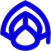</td><td align="center"></td><td align="center"></td><td align="center"></td><td align="center"></td>
</tr>
<tr>
<td align="center">Academy</td><td align="center">Accept Risk</td><td align="center">Accessibility</td><td align="center">Add</td><td align="center">Adhere to Policy</td>
</tr>
<tr>
<td align="center"></td><td align="center"></td><td align="center"></td><td align="center"></td><td align="center"></td>
</tr>
<tr>
<td align="center">Alerts New Risks</td><td align="center">Alibaba Cloud</td><td align="center">Amazon AWS</td><td align="center">API Documentation</td><td align="center">API Keys</td>
</tr>
<tr>
<td align="center"></td><td align="center"></td><td align="center"></td><td align="center"></td><td align="center"></td>
</tr>
<tr>
<td align="center">Approved Base Images</td><td align="center">Aqua</td><td align="center">Aqua Enforcer</td><td align="center">Aqua Plugin</td><td align="center">Aqua Score</td>
</tr>
<tr>
<td align="center">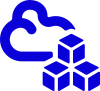</td><td align="center"></td><td align="center"></td><td align="center"></td><td align="center"></td>
</tr>
<tr>
<td align="center">Artifacts</td><td align="center">Assurance</td><td align="center">Assurance Violation</td><td align="center">Audit</td><td align="center">Audit Only</td>
</tr>
<tr>
<td align="center"></td><td align="center"></td><td align="center"></td><td align="center"></td><td align="center"></td>
</tr>
<tr>
<td align="center">Binary File</td><td align="center">Bitcoin Mining</td><td align="center">Block List Allow List</td><td align="center">Blocked Event</td><td align="center">Brute Force Attack</td>
</tr>
<tr>
<td align="center">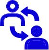</td><td align="center"></td><td align="center"></td><td align="center">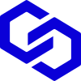</td><td align="center"></td>
</tr>
<tr>
<td align="center">C2Control</td><td align="center">Calendar</td><td align="center">Cattle</td><td align="center">ChainBench</td><td align="center">Change Password</td>
</tr>
<tr>
<td align="center"></td><td align="center"></td><td align="center"></td><td align="center">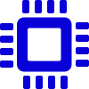</td><td align="center"></td>
</tr>
<tr>
<td align="center">Changelog</td><td align="center">Changelog 2</td><td align="center">Check Mark</td><td align="center">Chip</td><td align="center">CICD</td>
</tr>
<tr>
<td align="center"></td><td align="center"></td><td align="center"></td><td align="center"></td><td align="center"></td>
</tr>
<tr>
<td align="center">CIS Compliance</td><td align="center">Clean</td><td align="center">Clock</td><td align="center">Cloud Accounts</td><td align="center">Cloud architect</td>
</tr>
<tr>
<td align="center"></td><td align="center"></td><td align="center"></td><td align="center">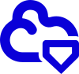</td><td align="center"></td>
</tr>
<tr>
<td align="center">Cloud Misconfiguration</td><td align="center">Cluster</td><td align="center">CNAPP</td><td align="center">CNDR</td><td align="center">Code Repositories</td>
</tr>
<tr>
<td align="center"></td><td align="center"></td><td align="center">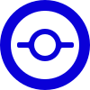</td><td align="center"></td><td align="center"></td>
</tr>
<tr>
<td align="center">Collect</td><td align="center">Collection Exfiltration</td><td align="center">Commit</td><td align="center">Communication</td><td align="center">Compliance</td>
</tr>
<tr>
<td align="center"></td><td align="center"></td><td align="center"></td><td align="center">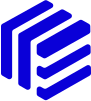</td><td align="center">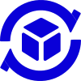</td>
</tr>
<tr>
<td align="center">Compliance Program</td><td align="center">Computer</td><td align="center">Container</td><td align="center">Container registry</td><td align="center">Continuous Deployment</td>
</tr>
<tr>
<td align="center">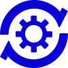</td><td align="center"></td><td align="center">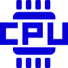</td><td align="center"></td><td align="center">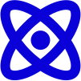</td>
</tr>
<tr>
<td align="center">Continuous Integration</td><td align="center">Count Arrows</td><td align="center">CPU</td><td align="center">CVE</td><td align="center">Cyber Intel</td>
</tr>
<tr>
<td align="center"></td><td align="center"></td><td align="center"></td><td align="center"></td><td align="center"></td>
</tr>
<tr>
<td align="center">Dashboard</td><td align="center">Data repository</td><td align="center">Database</td><td align="center">Debian</td><td align="center">Detection Events</td>
</tr>
<tr>
<td align="center">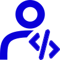</td><td align="center"></td><td align="center"></td><td align="center">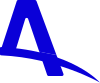</td><td align="center"></td>
</tr>
<tr>
<td align="center">Developer</td><td align="center">DevOps</td><td align="center">DevSecOps</td><td align="center">DISA Compliance</td><td align="center">Disconnected</td>
</tr>
<tr>
<td align="center"></td><td align="center"></td><td align="center"></td><td align="center"></td><td align="center"></td>
</tr>
<tr>
<td align="center">Docker</td><td align="center">Domain</td><td align="center">Down</td><td align="center">Download</td><td align="center">DTA</td>
</tr>
<tr>
<td align="center"></td><td align="center"></td><td align="center"></td><td align="center"></td><td align="center"></td>
</tr>
<tr>
<td align="center">DTA Icon</td><td align="center">DTA Risk</td><td align="center">eBPF</td><td align="center">Edit</td><td align="center">eLearning on demand</td>
</tr>
<tr>
<td align="center"></td><td align="center"></td><td align="center">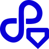</td><td align="center"></td><td align="center"></td>
</tr>
<tr>
<td align="center">Enforcers</td><td align="center">Enforcers Notification</td><td align="center">Environment</td><td align="center">Events</td><td align="center">Evidence</td>
</tr>
<tr>
<td align="center"></td><td align="center"></td><td align="center"></td><td align="center">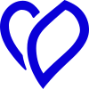</td><td align="center"></td>
</tr>
<tr>
<td align="center">Export</td><td align="center">Export PDF</td><td align="center">Failed</td><td align="center">Favorites</td><td align="center">File</td>
</tr>
<tr>
<td align="center"></td><td align="center"></td><td align="center"></td><td align="center"></td><td align="center"></td>
</tr>
<tr>
<td align="center">Filter</td><td align="center">Firewall</td><td align="center">Folder</td><td align="center">Forbidden Labels</td><td align="center">Full Screen</td>
</tr>
<tr>
<td align="center"></td><td align="center"></td><td align="center"></td><td align="center"></td><td align="center"></td>
</tr>
<tr>
<td align="center">Function</td><td align="center">Garbage</td><td align="center">Gateway</td><td align="center">Gateway New</td><td align="center">GitHub</td>
</tr>
<tr>
<td align="center"></td><td align="center"></td><td align="center"></td><td align="center"></td><td align="center"></td>
</tr>
<tr>
<td align="center">Goal</td><td align="center">Groups</td><td align="center">Hacker</td><td align="center">Hamburger</td><td align="center">Heartbeat</td>
</tr>
<tr>
<td align="center">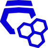</td><td align="center"></td><td align="center"></td><td align="center">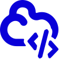</td><td align="center"></td>
</tr>
<tr>
<td align="center">Honeypot</td><td align="center">Hybrid</td><td align="center">IaaS</td><td align="center">IaC</td><td align="center">IAM</td>
</tr>
<tr>
<td align="center">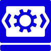</td><td align="center">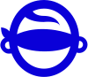</td><td align="center"></td><td align="center"></td><td align="center"></td>
</tr>
<tr>
<td align="center">IDE</td><td align="center">Ignore</td><td align="center">Image Profile Detached</td><td align="center">Image Unregistered</td><td align="center">Images</td>
</tr>
<tr>
<td align="center"></td><td align="center"></td><td align="center"></td><td align="center"></td><td align="center"></td>
</tr>
<tr>
<td align="center">Import</td><td align="center">Inbound Connection</td><td align="center">Info</td><td align="center">Infrastructure</td><td align="center">Infrastructure as code</td>
</tr>
<tr>
<td align="center"></td><td align="center"></td><td align="center"></td><td align="center"></td><td align="center"></td>
</tr>
<tr>
<td align="center">Initial Execution</td><td align="center">Insights</td><td align="center">Insights 2</td><td align="center">Instructor lead training</td><td align="center">Integration</td>
</tr>
<tr>
<td align="center"></td><td align="center"></td><td align="center"></td><td align="center"></td><td align="center"></td>
</tr>
<tr>
<td align="center">Inventory</td><td align="center">IP</td><td align="center">Jenkins</td><td align="center">Kube Hunter</td><td align="center">KubeEnforcer</td>
</tr>
<tr>
<td align="center"></td><td align="center"></td><td align="center"></td><td align="center"></td><td align="center"></td>
</tr>
<tr>
<td align="center">Kubernetes</td><td align="center">Lambda Amazon</td><td align="center">Left</td><td align="center">Linux</td><td align="center">Lock</td>
</tr>
<tr>
<td align="center"></td><td align="center"></td><td align="center"></td><td align="center"></td><td align="center"></td>
</tr>
<tr>
<td align="center">Log</td><td align="center">Logout</td><td align="center">Malware Detection</td><td align="center">Malware Tracking</td><td align="center">Mega Menu</td>
</tr>
<tr>
<td align="center">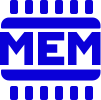</td><td align="center"></td><td align="center"></td><td align="center"></td><td align="center"></td>
</tr>
<tr>
<td align="center">Memory</td><td align="center">MicroEnforcer</td><td align="center">Microsoft Azure</td><td align="center">Misconfiguration</td><td align="center">Mitigation</td>
</tr>
<tr>
<td align="center"></td><td align="center">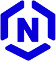</td><td align="center"></td><td align="center"></td><td align="center"></td>
</tr>
<tr>
<td align="center">More Vertical</td><td align="center">NanoEnforcer</td><td align="center">Nautilus</td><td align="center">Network Connection</td><td align="center">Network Connection WWW</td>
</tr>
<tr>
<td align="center"></td><td align="center"></td><td align="center"></td><td align="center"></td><td align="center"></td>
</tr>
<tr>
<td align="center">No Orch</td><td align="center">Nodes</td><td align="center">Notification Panel</td><td align="center">Notifications</td><td align="center">Off</td>
</tr>
<tr>
<td align="center"></td><td align="center"></td><td align="center"></td><td align="center">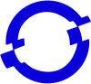</td><td align="center"></td>
</tr>
<tr>
<td align="center">OK</td><td align="center">On</td><td align="center">Open Source</td><td align="center">OpenShift</td><td align="center">OS Package Manager</td>
</tr>
<tr>
<td align="center">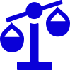</td><td align="center"></td><td align="center"></td><td align="center"></td><td align="center"></td>
</tr>
<tr>
<td align="center">OSS License</td><td align="center">Outbound Connection</td><td align="center">Pending</td><td align="center">PHP</td><td align="center">Plans and Prices</td>
</tr>
<tr>
<td align="center"></td><td align="center"></td><td align="center"></td><td align="center"></td><td align="center"></td>
</tr>
<tr>
<td align="center">Plans Pricing</td><td align="center">Play</td><td align="center">Pod Enforcer</td><td align="center">Pods</td><td align="center">Policies</td>
</tr>
<tr>
<td align="center"></td><td align="center"></td><td align="center"></td><td align="center"></td><td align="center"></td>
</tr>
<tr>
<td align="center">Policy Violation</td><td align="center">PostgreSQL</td><td align="center">Privacy</td><td align="center">Privileged</td><td align="center">Process</td>
</tr>
<tr>
<td align="center"></td><td align="center"></td><td align="center">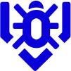</td><td align="center">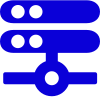</td><td align="center"></td>
</tr>
<tr>
<td align="center">Prometheus</td><td align="center">Propagation</td><td align="center">Protect Containerized Apps</td><td align="center">Proxy</td><td align="center">Quality Assurance</td>
</tr>
<tr>
<td align="center"></td><td align="center"></td><td align="center"></td><td align="center"></td><td align="center"></td>
</tr>
<tr>
<td align="center">Question Round</td><td align="center">Refresh</td><td align="center">Registries</td><td align="center">Remediation</td><td align="center">Reports</td>
</tr>
<tr>
<td align="center"></td><td align="center"></td><td align="center"></td><td align="center"></td><td align="center"></td>
</tr>
<tr>
<td align="center">Reset</td><td align="center">Resource</td><td align="center">Reverse</td><td align="center">Right</td><td align="center">SaaS</td>
</tr>
<tr>
<td align="center"></td><td align="center">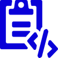</td><td align="center"></td><td align="center"></td><td align="center"></td>
</tr>
<tr>
<td align="center">SAST</td><td align="center">SBOM</td><td align="center">Scanning</td><td align="center">Schedule</td><td align="center">SCM Accounts</td>
</tr>
<tr>
<td align="center"></td><td align="center"></td><td align="center"></td><td align="center">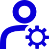</td><td align="center"></td>
</tr>
<tr>
<td align="center">Search</td><td align="center">Secrets</td><td align="center">Security</td><td align="center">Security specialist</td><td align="center">Sensitive Data</td>
</tr>
<tr>
<td align="center"></td><td align="center"></td><td align="center"></td><td align="center"></td><td align="center"></td>
</tr>
<tr>
<td align="center">Services</td><td align="center">Settings</td><td align="center">Settings Gear</td><td align="center">Show More</td><td align="center">SIEM</td>
</tr>
<tr>
<td align="center"></td><td align="center"></td><td align="center">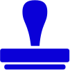</td><td align="center"></td><td align="center"></td>
</tr>
<tr>
<td align="center">SOC</td><td align="center">Speed</td><td align="center">Stamp</td><td align="center">Storage</td><td align="center">Storage 2</td>
</tr>
<tr>
<td align="center"></td><td align="center">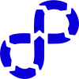</td><td align="center"></td><td align="center"></td><td align="center">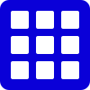</td>
</tr>
<tr>
<td align="center">Superuser</td><td align="center">SupplyChain</td><td align="center">Support Website</td><td align="center">Suppress</td><td align="center">Table</td>
</tr>
<tr>
<td align="center">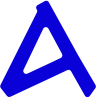</td><td align="center"></td><td align="center">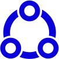</td><td align="center"></td><td align="center">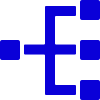</td>
</tr>
<tr>
<td align="center">TAS</td><td align="center">Tenant Manager</td><td align="center">Third Party</td><td align="center">Tools</td><td align="center">Tree</td>
</tr>
<tr>
<td align="center"></td><td align="center"></td><td align="center"></td><td align="center"></td><td align="center"></td>
</tr>
<tr>
<td align="center">Troubleshooting</td><td align="center">Ubuntu</td><td align="center">Unknown Image</td><td align="center">Up</td><td align="center">Upload</td>
</tr>
<tr>
<td align="center"></td><td align="center"></td><td align="center"></td><td align="center"></td><td align="center"></td>
</tr>
<tr>
<td align="center">Usage</td><td align="center">Video Camera</td><td align="center">Virtual classroom</td><td align="center">VM Enforcer</td><td align="center">Volume</td>
</tr>
<tr>
<td align="center"></td><td align="center"></td><td align="center"></td><td align="center"></td><td align="center"></td>
</tr>
<tr>
<td align="center">vShield</td><td align="center">Vulnerability Score</td><td align="center">Warning</td><td align="center">Warning Round</td><td align="center">Weaponization</td>
</tr>
<tr>
<td align="center"></td><td align="center"></td><td align="center"></td><td align="center"></td><td align="center"></td>
</tr>
<tr>
<td align="center">WordPress</td><td align="center">Workloads</td><td align="center">Workloads Misconfiguration</td><td align="center">ZoomIn</td><td align="center">ZoomOut</td>
</tr>
</table>
<!-- /table -->

## The Icon Grid

The icon grid establishes clear rules for the consistent, but flexible, positioning of graphic elements. 

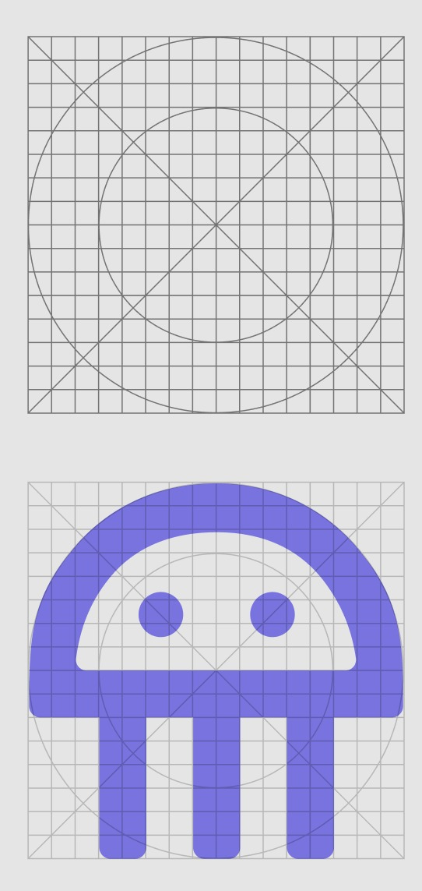

Keyline, minimalistic shapes are the foundation of the grid and define the boldness of our unique line of icons that reflect our values: We are the Experts, We are Bold. This grid was used also for the creation of Aqua Droplet Font. 

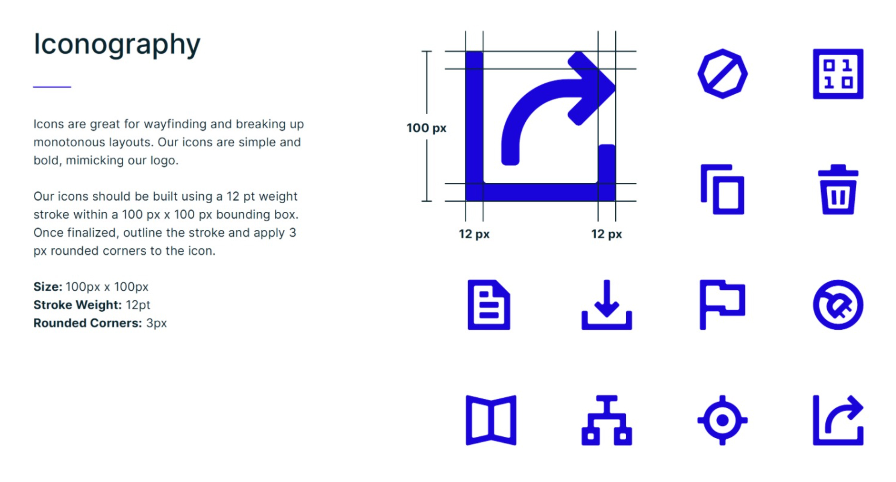

