# Cloud Security Icons

These icons are published under the extremely permissive *Creative Commons Zero v1.0 Universal* license. 

## Downloads

We provide all icon SVGs in both black and blue - download *icons.zip* from the [latest release](https://github.com/aquasecurity/cloudsec-icons/releases/latest).

## The Noun Project

We are now part of [The Noun Project](https://thenounproject.com/aquasec/) - the most comprehensive icon collection in the world!

## Draw.io Library

We also provide a [draw.io](https://draw.io) library. 

Here's how to use it to build awesome diagrams:

1. Download *draw.io.xml* from the  [latest release](https://github.com/aquasecurity/cloudsec-icons/releases/latest).
2. Navigate to https://draw.io and create a new diagram.
3. Click `File -> Open Library from -> Device`
4. Select the *draw.io.xml* you downloaded in Step 1.

## Icon Cheatsheet

<!-- table -->
<!--
* WARNING! *
This table has been automatically generated. Please do not edit directly, but run 'make generate' instead!
-->
<table width="100%">
<tr>
<td align="center"></td><td align="center"></td><td align="center">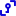</td><td align="center">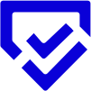</td><td align="center">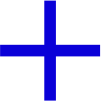</td>
</tr>
<tr>
<td align="center">3rd Party</td><td align="center">API Documentation</td><td align="center">API Keys</td><td align="center">Accept Risk</td><td align="center">Add</td>
</tr>
<tr>
<td align="center"></td><td align="center">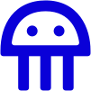</td><td align="center"></td><td align="center"></td><td align="center"></td>
</tr>
<tr>
<td align="center">Adhere To Policy</td><td align="center">Alerts New Risks</td><td align="center">Alibaba Clous</td><td align="center">Amazon AWS</td><td align="center">Approved Base Images</td>
</tr>
<tr>
<td align="center">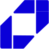</td><td align="center">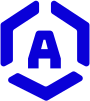</td><td align="center">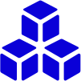</td><td align="center">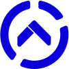</td><td align="center">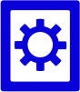</td>
</tr>
<tr>
<td align="center">Aqua</td><td align="center">Aqua Enforcer</td><td align="center">Aqua Plugin</td><td align="center">Aqua Score</td><td align="center">Assurance</td>
</tr>
<tr>
<td align="center">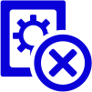</td><td align="center">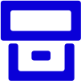</td><td align="center">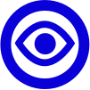</td><td align="center">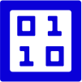</td><td align="center">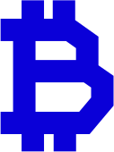</td>
</tr>
<tr>
<td align="center">Assurance Violation</td><td align="center">Audit</td><td align="center">Audit Only</td><td align="center">Binary File</td><td align="center">Bitcoin Mining</td>
</tr>
<tr>
<td align="center"></td><td align="center">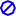</td><td align="center">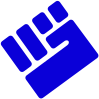</td><td align="center">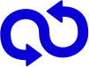</td><td align="center">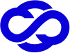</td>
</tr>
<tr>
<td align="center">Blacklist whitelist</td><td align="center">Blocked Event</td><td align="center">Brute Force Attack</td><td align="center">CICD</td><td align="center">CNAPP</td>
</tr>
<tr>
<td align="center">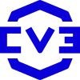</td><td align="center">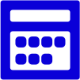</td><td align="center">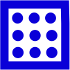</td><td align="center"></td><td align="center"></td>
</tr>
<tr>
<td align="center">CVE</td><td align="center">Calendar</td><td align="center">Cattle</td><td align="center">Change Password</td><td align="center">Changelog 2</td>
</tr>
<tr>
<td align="center">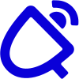</td><td align="center"></td><td align="center">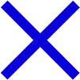</td><td align="center">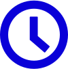</td><td align="center"></td>
</tr>
<tr>
<td align="center">Changelog</td><td align="center">Check Mark</td><td align="center">Clean</td><td align="center">Clock</td><td align="center">Close</td>
</tr>
<tr>
<td align="center"></td><td align="center"></td><td align="center">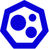</td><td align="center"></td><td align="center">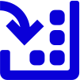</td>
</tr>
<tr>
<td align="center">Cloud Accounts</td><td align="center">Cloud Misconfiguration</td><td align="center">Cluster</td><td align="center">Collapse</td><td align="center">Collect</td>
</tr>
<tr>
<td align="center">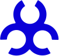</td><td align="center"></td><td align="center">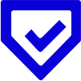</td><td align="center">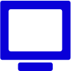</td><td align="center">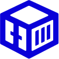</td>
</tr>
<tr>
<td align="center">Collection Exfiltration</td><td align="center">Communication</td><td align="center">Compliance</td><td align="center">Computer</td><td align="center">Container</td>
</tr>
<tr>
<td align="center">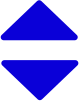</td><td align="center">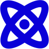</td><td align="center">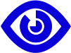</td><td align="center">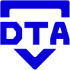</td><td align="center">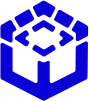</td>
</tr>
<tr>
<td align="center">Count Arrows</td><td align="center">Cyber Intel 1</td><td align="center">Cyber Intel 2</td><td align="center">DTA</td><td align="center">DTA Icon</td>
</tr>
<tr>
<td align="center"></td><td align="center"></td><td align="center"></td><td align="center">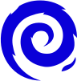</td><td align="center">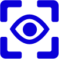</td>
</tr>
<tr>
<td align="center">DTA Risk</td><td align="center">Dashboard</td><td align="center">Database</td><td align="center">Debian</td><td align="center">Detection Events</td>
</tr>
<tr>
<td align="center"></td><td align="center">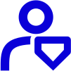</td><td align="center">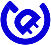</td><td align="center">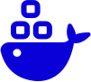</td><td align="center">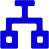</td>
</tr>
<tr>
<td align="center">DevOps</td><td align="center">DevSecOps</td><td align="center">Disconnected</td><td align="center">Docker</td><td align="center">Domain</td>
</tr>
<tr>
<td align="center"></td><td align="center">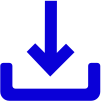</td><td align="center">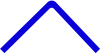</td><td align="center"></td><td align="center">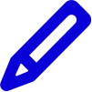</td>
</tr>
<tr>
<td align="center">Down</td><td align="center">Download</td><td align="center">DropUp</td><td align="center">Dropdown</td><td align="center">Edit</td>
</tr>
<tr>
<td align="center">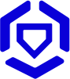</td><td align="center">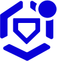</td><td align="center">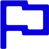</td><td align="center"></td><td align="center"></td>
</tr>
<tr>
<td align="center">Enforcers</td><td align="center">Enforcers Notification</td><td align="center">Events</td><td align="center">Evidence</td><td align="center">Expand</td>
</tr>
<tr>
<td align="center">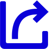</td><td align="center">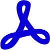</td><td align="center">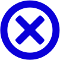</td><td align="center"></td><td align="center"></td>
</tr>
<tr>
<td align="center">Export</td><td align="center">Export PDF</td><td align="center">Failed</td><td align="center">File</td><td align="center">Filter</td>
</tr>
<tr>
<td align="center"></td><td align="center"></td><td align="center"></td><td align="center"></td><td align="center"></td>
</tr>
<tr>
<td align="center">Firewall</td><td align="center">Forbidden Labels</td><td align="center">Full Screen</td><td align="center">Function</td><td align="center">Garbage</td>
</tr>
<tr>
<td align="center"></td><td align="center"></td><td align="center"></td><td align="center"></td><td align="center"></td>
</tr>
<tr>
<td align="center">Gateaway</td><td align="center">Gateaway New</td><td align="center">Github</td><td align="center">Goal</td><td align="center">Grid</td>
</tr>
<tr>
<td align="center"></td><td align="center"></td><td align="center"></td><td align="center"></td><td align="center"></td>
</tr>
<tr>
<td align="center">Grid Risk</td><td align="center">Groups</td><td align="center">Hacker</td><td align="center">Hamburger</td><td align="center">Heartbeat</td>
</tr>
<tr>
<td align="center"></td><td align="center"></td><td align="center"></td><td align="center"></td><td align="center"></td>
</tr>
<tr>
<td align="center">Hybrid</td><td align="center">IP</td><td align="center">IaaS</td><td align="center">Image Profile Detached</td><td align="center">Image Unregistered</td>
</tr>
<tr>
<td align="center"></td><td align="center"></td><td align="center"></td><td align="center"></td><td align="center"></td>
</tr>
<tr>
<td align="center">Images</td><td align="center">Import</td><td align="center">Inbound Connection</td><td align="center">Info</td><td align="center">Infrastructure</td>
</tr>
<tr>
<td align="center"></td><td align="center"></td><td align="center"></td><td align="center"></td><td align="center"></td>
</tr>
<tr>
<td align="center">Initial Execution</td><td align="center">Insights 2</td><td align="center">Insights</td><td align="center">Integration</td><td align="center">Inventory</td>
</tr>
<tr>
<td align="center"></td><td align="center"></td><td align="center"></td><td align="center"></td><td align="center"></td>
</tr>
<tr>
<td align="center">Jenkins 2</td><td align="center">Jenkins</td><td align="center">Kube Enforcer</td><td align="center">Kube Hunter</td><td align="center">Kubernetes</td>
</tr>
<tr>
<td align="center"></td><td align="center"></td><td align="center"></td><td align="center"></td><td align="center"></td>
</tr>
<tr>
<td align="center">Lambda Amazon</td><td align="center">Left</td><td align="center">Linux 2</td><td align="center">Linux</td><td align="center">Log</td>
</tr>
<tr>
<td align="center"></td><td align="center"></td><td align="center"></td><td align="center"></td><td align="center"></td>
</tr>
<tr>
<td align="center">Logout</td><td align="center">Main Button</td><td align="center">Malware Detection</td><td align="center">Malware Tracking</td><td align="center">Micro Enforcer</td>
</tr>
<tr>
<td align="center"></td><td align="center"></td><td align="center"></td><td align="center"></td><td align="center"></td>
</tr>
<tr>
<td align="center">Microsoft Azure</td><td align="center">Misconfiguration</td><td align="center">Mitigation</td><td align="center">More Vertical</td><td align="center">Nano Enforcer</td>
</tr>
<tr>
<td align="center"></td><td align="center"></td><td align="center"></td><td align="center"></td><td align="center"></td>
</tr>
<tr>
<td align="center">Nautilus</td><td align="center">Network Connection</td><td align="center">Network Connection WWW</td><td align="center">No Orch</td><td align="center">Nodes</td>
</tr>
<tr>
<td align="center"></td><td align="center"></td><td align="center"></td><td align="center"></td><td align="center"></td>
</tr>
<tr>
<td align="center">Notification Panel</td><td align="center">Notifications</td><td align="center">OK</td><td align="center">OS Package Manager</td><td align="center">Off</td>
</tr>
<tr>
<td align="center"></td><td align="center"></td><td align="center"></td><td align="center"></td><td align="center"></td>
</tr>
<tr>
<td align="center">On</td><td align="center">Open Shift</td><td align="center">Outbound Connection</td><td align="center">PAS</td><td align="center">PHP</td>
</tr>
<tr>
<td align="center"></td><td align="center"></td><td align="center"></td><td align="center"></td><td align="center"></td>
</tr>
<tr>
<td align="center">Pending</td><td align="center">Plans Pricing 2</td><td align="center">Plans Pricing</td><td align="center">Plans and Prices</td><td align="center">Play</td>
</tr>
<tr>
<td align="center"></td><td align="center"></td><td align="center"></td><td align="center"></td><td align="center"></td>
</tr>
<tr>
<td align="center">Plus</td><td align="center">Pod Enforcer</td><td align="center">Pods</td><td align="center">Policies</td><td align="center">Policy</td>
</tr>
<tr>
<td align="center"></td><td align="center"></td><td align="center"></td><td align="center"></td><td align="center"></td>
</tr>
<tr>
<td align="center">Policy Violation</td><td align="center">Postgresql 2</td><td align="center">Postgresql</td><td align="center">Privileged</td><td align="center">Process</td>
</tr>
<tr>
<td align="center"></td><td align="center"></td><td align="center"></td><td align="center"></td><td align="center"></td>
</tr>
<tr>
<td align="center">Prometheus</td><td align="center">Propagation</td><td align="center">Protect Canisterized Apps</td><td align="center">Quality Assurance</td><td align="center">Question Round</td>
</tr>
<tr>
<td align="center"></td><td align="center"></td><td align="center"></td><td align="center"></td><td align="center"></td>
</tr>
<tr>
<td align="center">Refresh</td><td align="center">Registries</td><td align="center">Remediation</td><td align="center">Remidiation</td><td align="center">Reports</td>
</tr>
<tr>
<td align="center"></td><td align="center"></td><td align="center"></td><td align="center"></td><td align="center"></td>
</tr>
<tr>
<td align="center">Reset</td><td align="center">Resource</td><td align="center">Reverse</td><td align="center">Right</td><td align="center">SCM Accounts</td>
</tr>
<tr>
<td align="center"></td><td align="center"></td><td align="center"></td><td align="center"></td><td align="center"></td>
</tr>
<tr>
<td align="center">SIEM</td><td align="center">SOC</td><td align="center">SaaS</td><td align="center">Scanning</td><td align="center">Schedule</td>
</tr>
<tr>
<td align="center"></td><td align="center"></td><td align="center"></td><td align="center"></td><td align="center"></td>
</tr>
<tr>
<td align="center">Search</td><td align="center">Secrets</td><td align="center">Security</td><td align="center">Sensitive Data</td><td align="center">Services</td>
</tr>
<tr>
<td align="center"></td><td align="center"></td><td align="center"></td><td align="center"></td><td align="center"></td>
</tr>
<tr>
<td align="center">Settings</td><td align="center">Settings Gear</td><td align="center">Show More</td><td align="center">Speed</td><td align="center">Storage 2</td>
</tr>
<tr>
<td align="center"></td><td align="center"></td><td align="center"></td><td align="center"></td><td align="center"></td>
</tr>
<tr>
<td align="center">Storage</td><td align="center">Super User</td><td align="center">Superuser</td><td align="center">Support Website</td><td align="center">Suppress</td>
</tr>
<tr>
<td align="center"></td><td align="center"></td><td align="center"></td><td align="center"></td><td align="center"></td>
</tr>
<tr>
<td align="center">Tenant Manager</td><td align="center">Tools</td><td align="center">Troubleshooting</td><td align="center">Ubuntu</td><td align="center">Unknown Image</td>
</tr>
<tr>
<td align="center"></td><td align="center"></td><td align="center"></td><td align="center"></td><td align="center"></td>
</tr>
<tr>
<td align="center">Up</td><td align="center">Upload</td><td align="center">Usage</td><td align="center">VM Enforcer</td><td align="center">VShield</td>
</tr>
<tr>
<td align="center"></td><td align="center"></td><td align="center"></td><td align="center"></td><td align="center"></td>
</tr>
<tr>
<td align="center">Video Camera</td><td align="center">Volume</td><td align="center">Vulnerability Score</td><td align="center">Warning</td><td align="center">Warning Round</td>
</tr>
<tr>
<td align="center"></td><td align="center"></td><td align="center"></td><td align="center"></td><td align="center"></td>
</tr>
<tr>
<td align="center">Weaponization</td><td align="center">Wordpress</td><td align="center">Workloads</td><td align="center">Workloads Misconfiguration</td><td align="center">ZoomIn</td>
</tr>
<tr>
<td align="center"></td><td></td><td></td><td></td><td></td>
</tr>
<tr>
<td align="center">ZoomOut</td><td></td><td></td><td></td><td></td>
</tr>
</table>
<!-- /table -->
